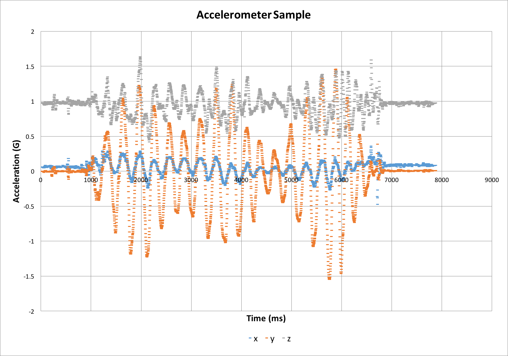

# Accelerometer Logger

This project is an WiFi enabled accelerometer, built for engineering and physics students to wirelessly capture acceleration data. 

### Introduction

The accelerometer is built using components available on the Internet. At the heart is the LIS3DH accelerometer, capable of ranges up to 16G and sample rates up to 400 Hz. Multiple accelerometers can be used, with simultaneous activation and data collection.

Included in this repo are:

- [Materials list](./MATERIALS.md)
- Instructions for assembling accelerometers
- Firmware source code for the accelerometer
- Server source code for capturing data
- Sample data and lesson examples

### Pre-requisite skills

- Some light soldering
- The ability to find your computer's IP address
- A little bit of coding. You must modify the firmware code to input the server's IP address and port 

### License

This software and associated materials are Copyright (c) 2016 by the Texas Advanced Computing Center, protected under the MIT License. [Full text of the license can be found here](./LICENSE.txt).